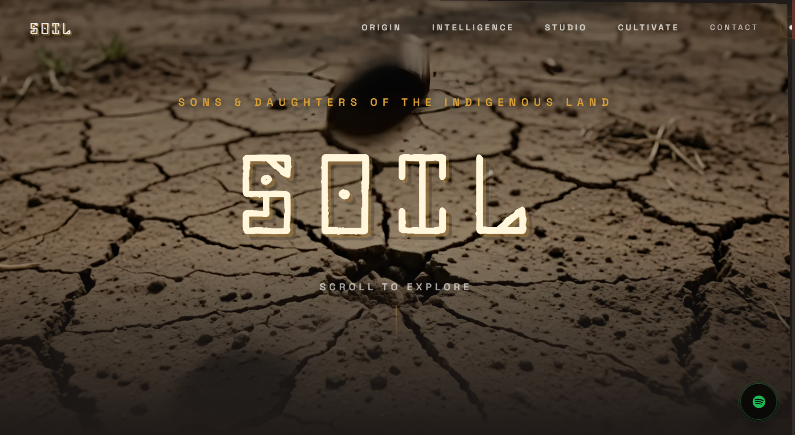
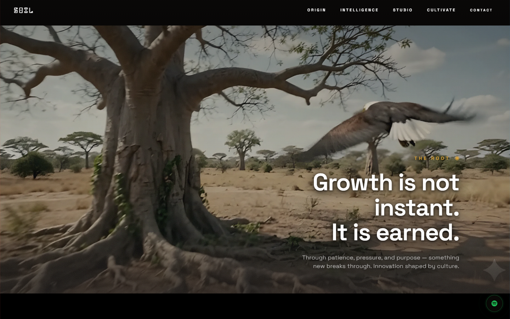
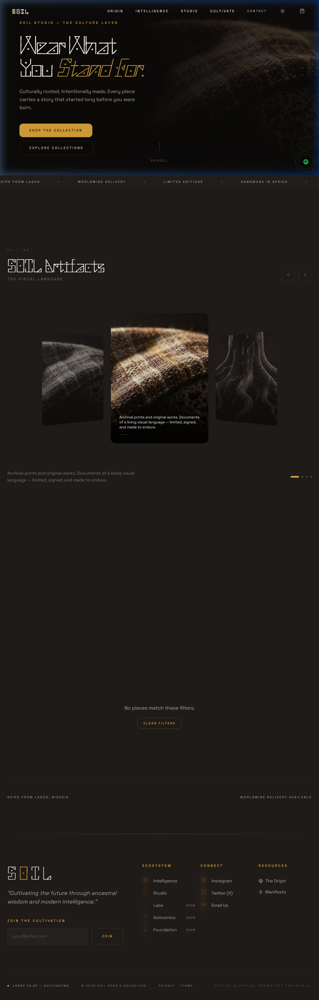
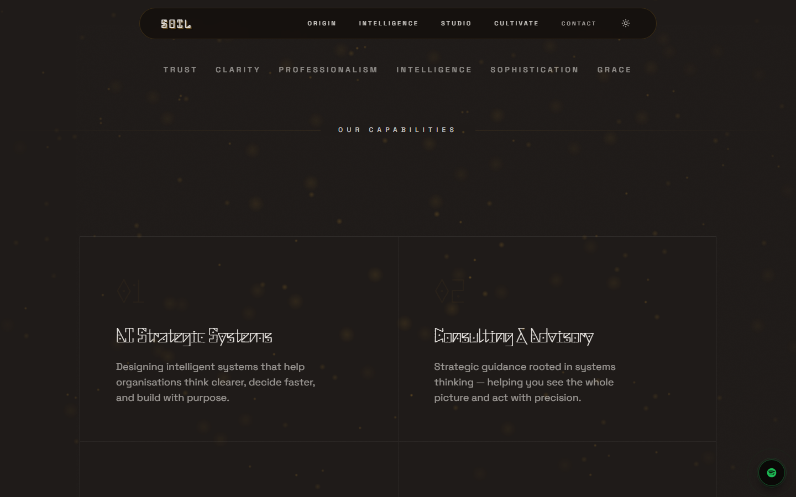
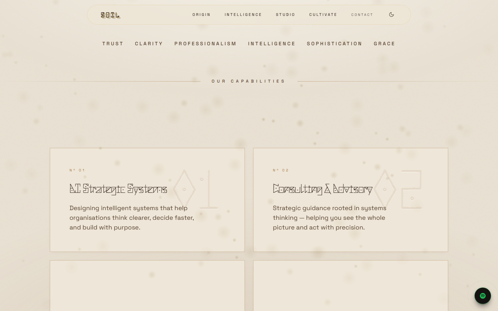
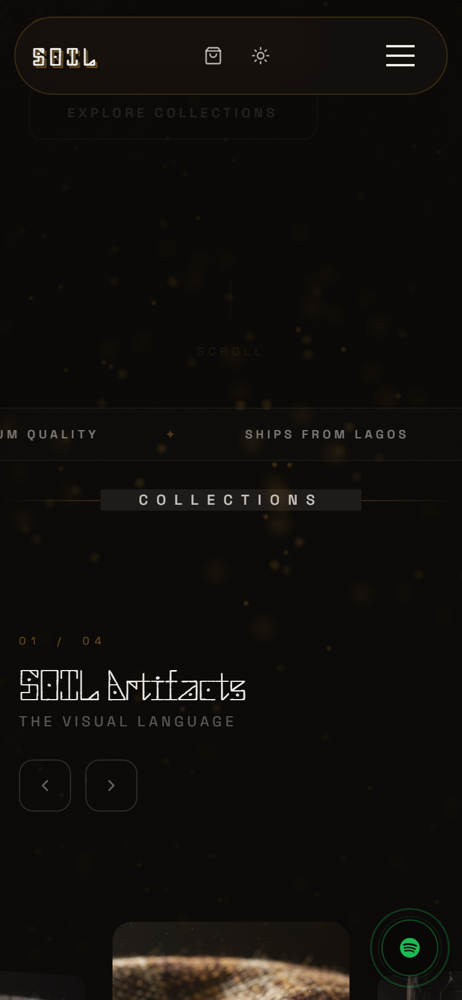

# SOIL — Sons & Daughters of the Indigenous Land

> *A cinematic, immersive web experience celebrating Indigenous African identity, culture, and artistry.*


---

## 🌐 Live Demo

**[soil-jet.vercel.app](https://soil-jet.vercel.app)**

---

## About This Project

SOIL is a full-stack cultural platform and e-commerce site built for a client in the African creative industry. The platform blends cinematic storytelling with a fully functional online studio — combining scroll-driven canvas experiences, real-time 3D, immersive page transitions, and a live Supabase-powered shop with real payment processing.

**This repo is my personal portfolio snapshot of the project.** The original collaborative repository lives at [chibbss/SOIL-v1](https://github.com/chibbss/SOIL-v1).

---

## Screenshots

| | |
|---|---|
|  |  |
| *Homepage — cinematic hero with sacred glyph title* | *Scroll experience — canvas frame sequence mid-scrub* |

| | |
|---|---|
|  |  |
| *Studio — cultural e-commerce store* | *Cultivate — living network ecosystem view* |

**Dual theme system** — the same page in cinematic dark and archival-parchment light:

| | |
|---|---|
|  |  |
| *Intelligence — cinematic dark (default)* | *Intelligence — archival light mode: parchment, bronze rules, engraved watermark numerals* |

| |
|---|
|  |
| *Mobile responsive layout* |

---

## Engineering Highlights

The three pieces of this build I'm most proud of — each solved a problem that had no off-the-shelf answer.

### 🦅 Scroll-Driven Canvas Frame Sequence
The homepage hero scrubs a **192-frame WebP sequence** through an eagle's flight and landing, driven entirely by scroll position.

- Replaced a `<video>`-scrubbing approach (which stutters badly, since seeking forces decode from the nearest keyframe) with a **canvas image-sequence pipeline** — every frame is independently addressable, so scrubbing backwards is as cheap as forwards.
- **Decode pre-pass:** frames are decoded via `img.decode()` *before* the canvas ever draws them, moving decode cost off the scroll critical path — otherwise the first pass through the sequence pays a decode stall on every frame.
- **Keyframe-first load order:** rather than loading frames 1→192 sequentially, an evenly-spread set of anchor frames loads first, so any scroll position has nearby coverage immediately, then progressively fills in via stride-halving.
- **Lenis smooth scroll** converts ratchety wheel/trackpad input into a continuous velocity stream, so the sequence glides instead of stepping.

### 🕊️ Real-Time 3D Bird Flock (Boids)
A page-wide sky of rigged 3D doves, simulated and rendered live — no video, no sprites.

- **Boids flocking simulation** (separation / alignment / cohesion) written from scratch on the CPU, with a weighted-steering model tuned so the flock reads as *one organism* rather than scattered agents — plus cursor-based scatter.
- **Flight stabilization:** orientation is derived from a *pitch-clamped* flight vector and slerped per-frame, with a travel-direction turn-rate cap. This solves the classic failure modes — birds rolling upside-down, banking to knife-edge, or gliding tail-first when the heading vector goes noisy at low horizontal speed.
- Rendered with **React Three Fiber** using instanced rigged GLTF models with baked wing-flap animation.
- **Perf-gated:** the WebGL layer only mounts as the user approaches its section, so it never competes with the canvas scrub above it.

### 🎨 Dual Theme System — Cinematic Dark ⇄ Archival Light
A full light mode that isn't an inversion of the dark theme, but its own designed world.

- **Dark** is the default: deep soil, gold, mystery. **Light** is an *archival parchment* language — aged paper ground, umber ink, bronze rules, and a barely-there fibre texture, built to feel like "a living archive of indigenous intelligence."
- Built on **HSL CSS custom properties** driving semantic Tailwind tokens, toggled via a `.dark` class with a **no-flash inline script** that applies the stored theme before first paint.
- **Route-aware:** the cinematic homepage and the admin area are pinned to dark regardless of preference; everything else follows the user's choice (persisted to `localStorage`).
- Theme-aware atmosphere: the ambient dust particles retune per theme (gold motes on dark, softer ochre haze on parchment) rather than being reused blindly.

---

## My Role — Frontend Developer

I joined as the **frontend developer**, responsible for translating the client's creative vision into performant, pixel-accurate React code.

### 🎬 Cinematic Scroll Experience (v3 Overhaul)
- Architected the canvas-based scrollytelling system described above (192-frame sequence + decode pre-pass + keyframe-first loading)
- Re-implemented the scrubbing engine after diagnosing performance regressions in the original video-element approach
- Engineered the narrative text layout with responsive typography scaling

### 🗺️ Intelligence Page
- Built the **Intelligence page** from scratch — a content-rich editorial layout
- Scroll-triggered section reveals and animated transitions
- Later redesigned its light-mode treatment into archival "knowledge panels" with engraved watermark numerals

### 📖 Cultivate Page & Route Transitions
- Implemented the **Cultivate page** — a narrative scroll experience with an ecosystem network view and immersive full-bleed visuals
- Built **page-level route transitions** with Framer Motion for seamless navigation

### ✨ UI System & Visual Polish
- Implemented the **v3 experience overhaul** across Ecosystem, Studio, and Home — unifying visual language, spacing, and motion
- Designed the **ancient-futuristic sacred glyph system** for decorative UI and loading states
- Built the **magnetic cursor** and **particle dust** systems
- Rebuilt **Navbar** and **Footer** with mobile-responsive, scroll-aware behaviour
- Accessibility pass: focus rings, keyboard-operable cards, skip links, and full `prefers-reduced-motion` support (motion is damped rather than dead)

---

## Tech Stack

| Layer | Technology |
|---|---|
| Framework | React 18 + Vite 6 |
| Styling | Tailwind CSS + HSL token design system |
| Animation | Framer Motion + Lenis smooth scroll |
| 3D / Canvas | Three.js + React Three Fiber + Drei |
| Database & Auth | Supabase (PostgreSQL + RLS) |
| Payments | Paystack (NGN + USD multi-currency) |
| Email | Resend (transactional order emails) |
| Error Monitoring | Sentry |
| State Management | Zustand + TanStack Query |
| Testing | Vitest |
| Hosting | Vercel (serverless functions + CDN) |

---

## Pages & Features

| Page / Feature | Description |
|---|---|
| **Home** | Cinematic hero with scroll-driven 192-frame canvas eagle sequence + live 3D bird flock |
| **Intelligence** | Editorial content hub with scroll reveals and archival light-mode panels |
| **Cultivate** | Narrative scroll experience with ecosystem network view |
| **Studio** | Full e-commerce store — collections, product pages, cart, filters, Paystack checkout |
| **Admin Dashboard** | CMS for products, orders, site settings, and subscriber management |
| **Theming** | Dark ⇄ archival-light with persistence and no-flash load |
| **Spotify Integration** | Embedded SOIL playlist player |
| **Contact Modal** | Multi-field contact form with Supabase submission |
| **Cookie Consent** | GDPR-style consent banner |

---

## Getting Started

### Prerequisites
- Node.js 18+
- A [Supabase](https://supabase.com) project
- A [Paystack](https://paystack.com) account (for payments)

### Installation

```bash
# Clone the repo
git clone https://github.com/Joshua-Ochiba/SOIL.git
cd SOIL

# Install dependencies
npm install

# Set up environment variables
cp .env.example .env.local
# Fill in your Supabase, Paystack, and Resend keys

# Start the dev server
npm run dev
```

### Available Scripts

```bash
npm run dev        # Start development server
npm run build      # Production build
npm run preview    # Preview production build locally
npm run test       # Run test suite (Vitest)
npm run lint       # Lint with ESLint
```

---

## Environment Variables

See [`.env.example`](.env.example) for all required variables. You'll need:

- `VITE_SUPABASE_URL` + `VITE_SUPABASE_ANON_KEY` — from your Supabase project
- `PAYSTACK_SECRET_KEY` — from Paystack dashboard
- `RESEND_API_KEY` + `RESEND_FROM_EMAIL` — for transactional emails (optional)
- `VITE_SENTRY_DSN` — for error monitoring (optional)

---

## Project Structure

```
api/                      # Vercel serverless functions
├── initialize-transaction.js   # Paystack payment init
├── verify-transaction.js       # Payment verification
├── webhook.js                  # Paystack webhook → order fulfilment
└── health.js                   # Deployment health check

src/
├── components/
│   ├── world/            # Canvas frame sequence + cinematic overlays
│   ├── home/             # Home scroll & narrative components
│   ├── soil/             # Brand UI — bird flock, particle dust, glyphs, footer
│   ├── studio/           # Cart, ProductCard, StoreControls, carousel
│   ├── shared/           # Navbar, ThemeToggle, ContactModal, SpotifyPlayer
│   ├── admin/            # CMS panels
│   └── ui/               # Radix UI primitives + shadcn/ui components
├── pages/                # Route-level page components
├── hooks/                # Custom React hooks (useIsDark, usePrice, useAuth...)
├── store/                # Zustand global state (theme, cart, currency, ui)
├── lib/                  # Supabase client, monitoring, utilities
└── data/                 # Static product data

supabase/                 # SQL schema, RLS policies, inventory functions
tests/                    # Vitest test suite
```

---

## Acknowledgements

This was a collaborative project with [chibbss](https://github.com/chibbss). I joined as frontend developer to implement the designs and enhance the experience.

---

*Built with intention. Rooted in culture.*
